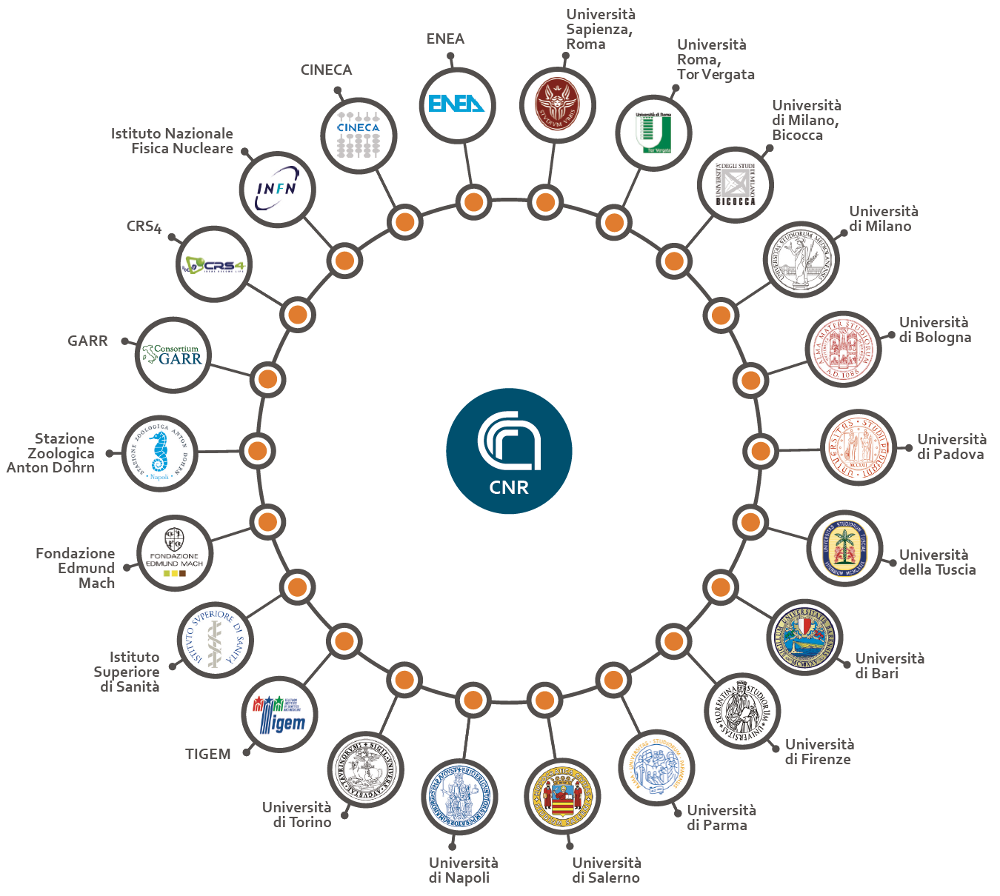
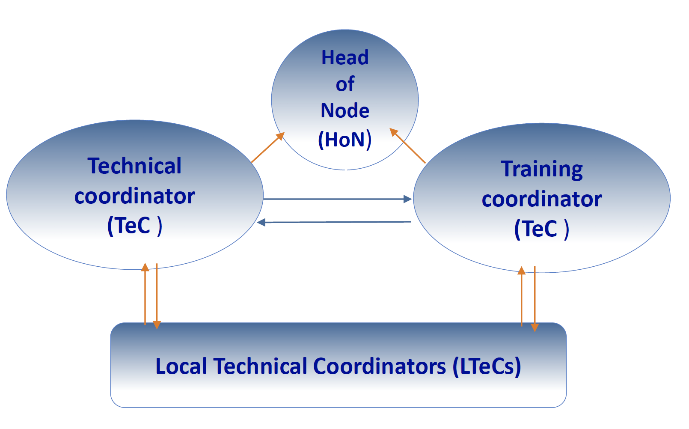

```{r setup, include=FALSE}
knitr::opts_chunk$set(echo = TRUE)

```

## The team

In January 2019 The University of Turin became part of [*Elixir IT*](https://elixir-italy.org/), which is is the Italian Node of [*ELIXIR*](https://elixir-europe.org/). Its mission is to drive the development of bioinformatics resources in Italy and integrate them into ELIXIR’s pan European service portfolio.
{width=40%}

Prof. [*Raffaele A Calogero*](mailto:raffaele.calogero@unito.it) is the representative of the University at the GENERAL ASSEMBLY of Elixir Italy. Dr. [*Marco Beccuti*](mailto:beccuti@di.unito.it) and Prof. [*Raffaele A Calogero*](mailto:raffaele.calogero@unito.it) are the LOCAL TECHNICAL COORDINATORS (LTeCs), which acxt as connection between Univeristy of Torino researchers and the Elixir Italy node.
{width=40%}

Any people of the University of Torino can contact the LTeCs to participate to the activity of Elixir.
This web site has been prepared to provide information on the activities in which the Torino team is involved.
To facilitate the spread of the Elixir activities we have build a team incorporating some of the bioinformatics/OMICs experts present in our University:

- Genomics:

    + Prof. [*Raffaele A. Calogero*](mail.to:raffaele.calogero@unito.it) (Dept.Molecular Biotechnology and Health Sciences) [**Web page**](https://orcid.org/0000-0002-2848-628X/print)

    + [*Paolo Provero*](mailto:paolo.provero@unito.it) (Dept.Molecular Biotechnology and Health Sciences) **Web page**

-  Tool development e mathematical models:

    + Dr. [*Francesca Cordero*](mailto:francesca.cordero@unito.it) (Dept. of Computer Science) **Web page**

    + Dr. [*Marco Beccuti*](mailto:beccuti@di.unito.it)  (Dept. of Computer Science) **Web page**

- System Biology:

    + Prof. [*Michele Caselle*](mailto:caselle@to.infn.it)  (Dept. of Physics) [**Web page**](http://personalpages.to.infn.it/~caselle/BioPhys/BioPhys.html)

- Machine-learning applications in Biology and Medicine:

    + Prof. [*Piero Fariselli*](mailto:piero.fariselli@unito.it) (Dept. of Medical Sciences) [**Web page**](https://www.unito.it/persone/pfarisel)

- Epigenetics:

    + Prof. [*Salvatore Oliviero*](mailto:salvatore.oliviero@unito.it)  (Dept. of Life Sciences and System Biology) **Web page**

- Human genomes datasets:

  + Prof. [*Giuseppe Matullo*](mailto:giuseppe.matullo@unito.it) (Dept. of Medical Sciences) **Web page**
  
Elixir UNITO team is available to answer to technical queries referring to their specific expertises.
For more information about the activity of Elixir please contact  [*Raffaele A. Calogero*](mail.to:raffaele.calogero@unito.it)
  
## On going activity of the team

Here you find the on going activities in which the Elixir Torino team is actually involved:


### Bioinformatics and reproducibility

Calogero, Cordero and Beccuti are the co-founder of the [*reproducible-bioinformatics.org*](http://reproducible-bioinformatics.org/) community, which is involved in the development of user friendly bioinformatics tools granting computational and functional reproducibility.

**Related pubblications**:

- [*Beccuti et al. Bioinformatics 2019*](https://www.ncbi.nlm.nih.gov/pubmed/29069297)

- [*Kulkarni et al. BMC Bioinformatics 2018*](https://www.ncbi.nlm.nih.gov/pubmed/30367595)


**Software**:

- [*docker4seq*](https://github.com/kendomaniac/docker4seq)

- [*4SeqGUI*](https://github.com/mbeccuti/4SeqGUI)


### Machine learning

Prof. Fariselli has a long-standing experience in the development of computational tools for
biomolecule feature predictions, and machine-learning applications in Biology and Medicine.

**Related pubblications**:

- [*Milan et al. Tracing seafood at high spatial resolution using NGS-generated data and machine learning: Comparing microbiome versus SNPs. Food Chem. 2019*](https://www.ncbi.nlm.nih.gov/pubmed/30827626)

- [*Montanucci et al. DDGun: an untrained method for the prediction of protein stability changes upon single and multiple point variations. BMC Bioinformatics. 2019*](https://www.ncbi.nlm.nih.gov/pubmed/31266447)

-  [*Capriotti et al. Fido-SNP: the first webserver for scoring the impact of single nucleotide variants in the dog genome. Nucleic Acids Res. 2019*](https://www.ncbi.nlm.nih.gov/pubmed/31114899)


### Single cells data analysis

Calogero, Cordero and Beccuti together with their research groups are involved in tools development and analysis of single cell sequencing.

**Related pubblications**:

- Ordonez-Rueda et al. Apoptotic cell exclusion and bias-free single-cell selection are important QC requirements for successful single-cell sequencing applications. Cytometry Part A, accepted for publication. 

- [*Alessandri et al. rCASC: reproducible classification analysis of single-cell sequencing data. Gigascience 2019*](https://academic.oup.com/gigascience/article/doi/10.1093/gigascience/giz105/5565135?guestAccessKey=5f15ef82-280e-48ea-a984-2472e8d9be75). 

- [*Alessandri et al. Differential Expression Analysis in Single-Cell Transcriptomics. Methods Mol Biol 2019*](https://www.ncbi.nlm.nih.gov/pubmed/31028652)

- [*Rodriguez-Fraticelli et al. Clonal analysis of lineage fate in native haematopoiesis. Nature 2018*](https://www.ncbi.nlm.nih.gov/pubmed/29323290)

### Mathematical models

Beccuti has a multi-year experience in mathematical models applied in the area of life sciences

**Related pubblications**:

- [*Beccuti et al. HashClone: a new tool to quantify the minimal residual disease in B-cell lymphoma from deep sequencing data. BMC Bioinformatics. 2017*](https://www.ncbi.nlm.nih.gov/pubmed/29169317)

- [*Medico et al. The molecular landscape of colorectal cancer cell lines unveils clinically actionable kinase targets. Nat. Commun. 2015*](https://www.ncbi.nlm.nih.gov/pubmed/25926053)

- [*Cordero et al. Multi-level model for the investigation of oncoantigen-driven vaccination effect. BMC Bioinformatics. 2013*](https://www.ncbi.nlm.nih.gov/pubmed/23734974)


### System Biology

Prof Caselle has a multi-years experience in Quantitative Biology.

**Related pubblications**:

- [*Cantini et al. Hope4Genes: a Hopfield-like class prediction algorithm for transcriptomic data. Sci Rep. 2019*](https://www.ncbi.nlm.nih.gov/pubmed/30674955)

- [*Cora' et al. The Epithelial-Mesenchymal Transition, as Hacked by a microRNA Combinatorial Code. Cell Syst. 2018*](https://www.ncbi.nlm.nih.gov/pubmed/30048619)

- [*Rosanova et al. Modelling the evolution of transcription factor binding preferences in complex eukaryotes. Sci Rep. 2017*](https://www.ncbi.nlm.nih.gov/pubmed/28790414)


### Biomarker discovery

Cordero, Calogero and Beccuti are involved in biomarker discovery in Oncology and neurodegenerative diseases.

**Related pubblications**:

- [*Follia et al. Integrative Analysis of Novel Metabolic Subtypes in Pancreatic Cancer Fosters New Prognostic Biomarkers. Front Oncol. 2019*](https://www.ncbi.nlm.nih.gov/pubmed/30873387)

- [*Gagliardi et al. Long non-coding and coding RNAs characterization in Peripheral Blood Mononuclear Cells and Spinal Cord from Amyotrophic Lateral Sclerosis patients. Sci Rep. 2018*](https://www.ncbi.nlm.nih.gov/pubmed/29402919)

- [*Cordero et al. Differentially methylated microRNAs in prediagnostic samples of subjects who developed breast cancer in the European Prospective Investigation into Nutrition and Cancer (EPIC-Italy) cohort. Carcinogenesis. 2015*](https://www.ncbi.nlm.nih.gov/pubmed/26168820)


### Epigenetics

Prof. Oliviero has a multi-year esperience in epigenetics

**Related pubblications**:

- [*Dastsooz et al. A Comprehensive Bioinformatics Analysis of UBE2C in Cancers. Int J Mol Sci. 2019*](https://www.ncbi.nlm.nih.gov/pubmed/31067633)

- [*Incarnato et al. RNA Framework: an all-in-one toolkit for the analysis of RNA structures and post-transcriptional modifications. Nucleic Acids Res. 2018 *](https://www.ncbi.nlm.nih.gov/pubmed/29893890)

- [*Fusella et al. The IKK/NF-κB signaling pathway requires Morgana to drive breast cancer metastasis. Nat Commun. 2017*](https://www.ncbi.nlm.nih.gov/pubmed/29158506)


### Genomics

Prof. Matullo is involved in large genomics studies. Prof Provero focus on the interpretation of high-dimension genomics data.

**Related pubblications**:

- [*Fiorito et al. Socioeconomic position, lifestyle habits and biomarkers of epigenetic aging: a multi-cohort analysis. Aging (Albany NY). 2019 *](https://www.ncbi.nlm.nih.gov/pubmed/31009935)

- [*Dam et al. Association of menopausal characteristics and risk of coronary heart disease: a pan-European case-cohort analysis. Int J Epidemiol. 2019*](https://www.ncbi.nlm.nih.gov/pubmed/30796459)

- [*Tappaqro et al. Renal Regenerative Potential of Extracellular Vesicles Derived from miRNA-Engineered Mesenchymal Stromal Cells. Int J Mol Sci. 2019*](https://www.ncbi.nlm.nih.gov/pubmed/31091699)

- [*Perron et al. In silico prediction of lncRNA function using tissue specific and evolutionary conserved expression. BMC Bioinformatics. 2017*](https://www.ncbi.nlm.nih.gov/pubmed/28361701)


